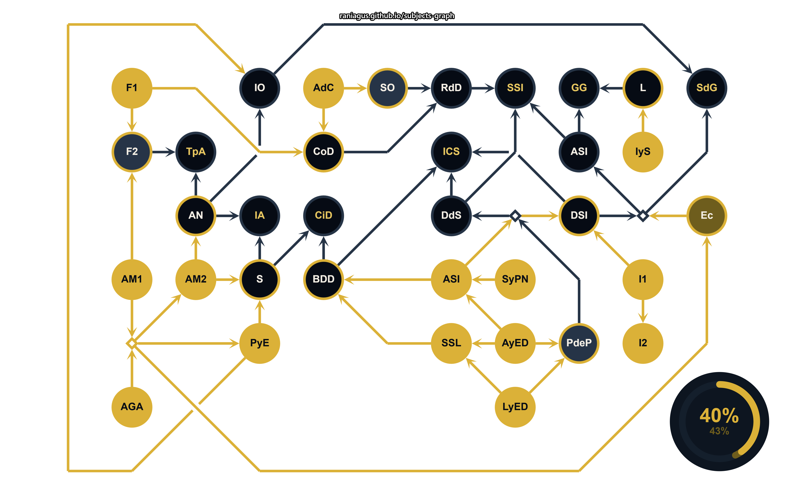

## ¡Hola!
### Mi nombre es Julián Colman
#### Mi legajo es 213.605-3
Sobre mí:

- Tengo **21 años**.
- Soy del barrio de *La Paternal*.
- Soy hincha fanático del club más popular del mundo, el *Club Atlético Boca Juniors*.
- Soy de Boca, por lo que justifica que esté recursando la materia. 😅
- Me gusta tocar el teclado y la guitarra, donde trato de interpretar, entre otras cosas, a mis artistas favoritos (Cerati, Los Piojos, Los Redondos, etc.). 🎸
- Trabajo de Soporte en un software de gestión para administradores de consorcios.
- Realicé varios cursos relacionados al mundo de los sistemas de información. Entre ellos, destaco un curso llevado a cabo por UMSA en el año 2024, donde dediqué 135 horas para profundizar conocimientos en Java y React, pudiendo así desarrollar mi primera página web. Me interesa dejar los enlaces al repo del proyecto Backend: https://github.com/csantander93/equipo1ObraSocialUMSA ; Frontend: https://github.com/csantander93/equipo1-obraSocial-Frontend .

Este es mi progreso actual en la carrera:

